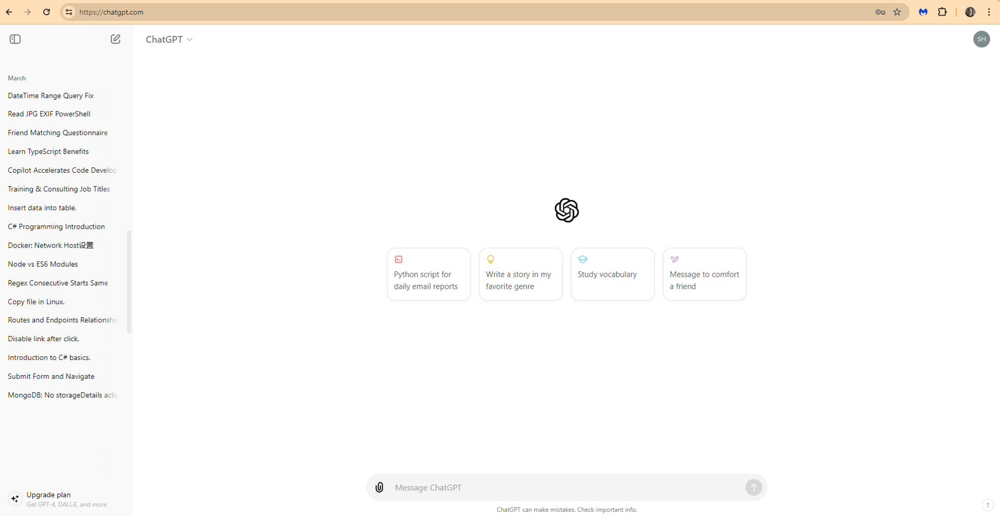
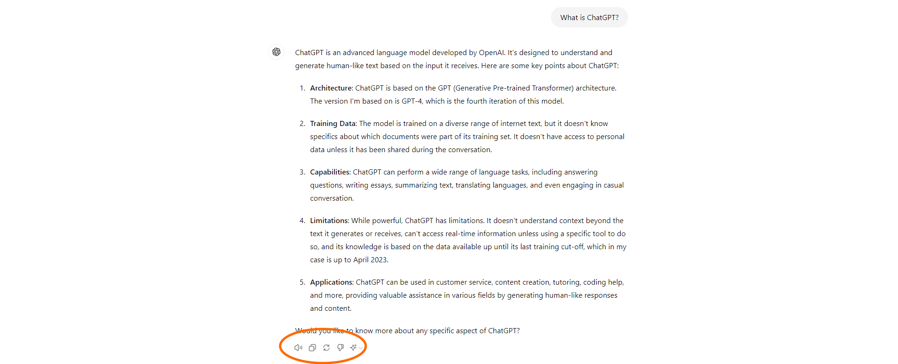
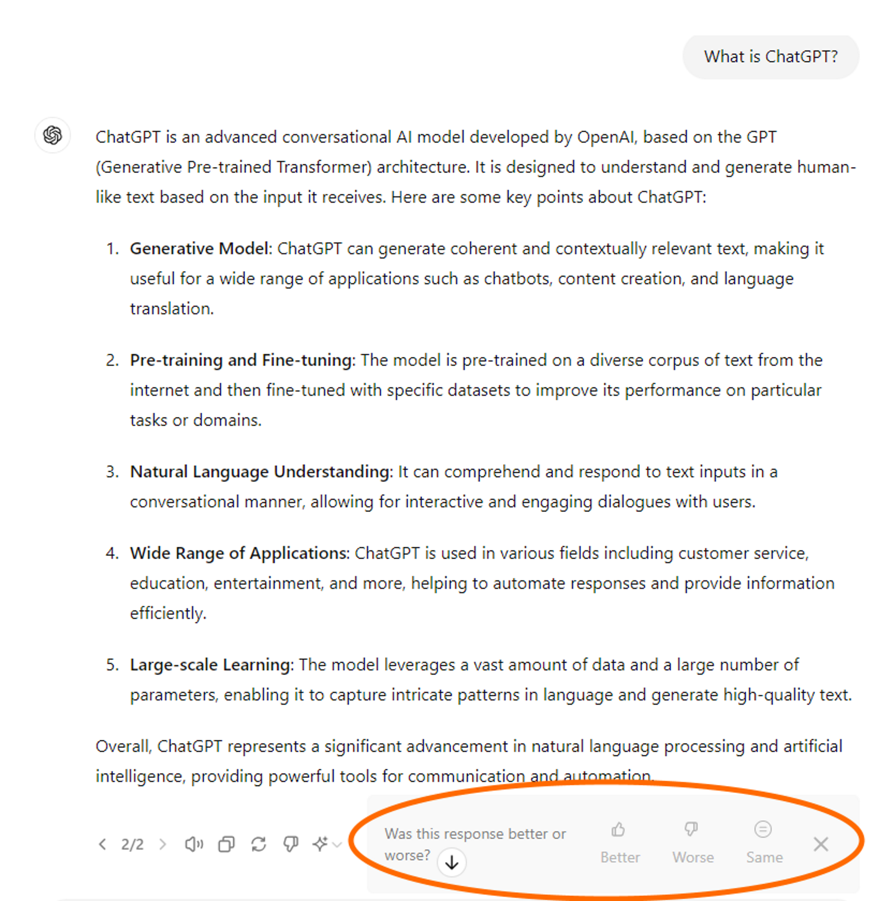
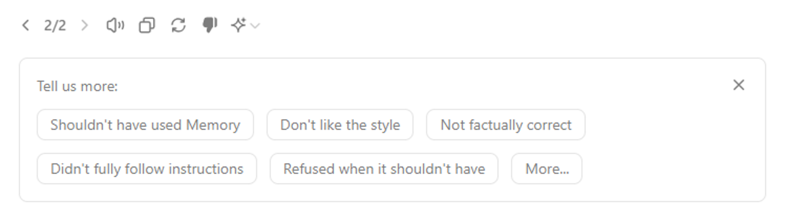

# ChatGPT

* Open [ChatGPT](https://chatgpt.com/) in your browser.

**Important**: Highlight that you will need a free OpenAI account to use ChatGPT. If you don't have a free account click the `Sign up` button and follow the steps to create a free account.

* Explain that ChatGPT is an AI chatbot and virtual assistant. It has a simple web interface that allows you to enter prompts and receive responses.

    

* ChatGPT is based on an LLM and uses ML and NLP to accept prompts and provide responses using natural language.

* Enter the following prompt:

  ```text
  What is ChatGPT?
  ```

* ChatGPT will provide a response that may be similar to the following example:

    ```text
    ChatGPT is an advanced language model developed by OpenAI. It's designed to understand and generate human-like text based on the input it receives. Here are some key points about ChatGPT:

    1. **Architecture**: ChatGPT is based on the GPT (Generative Pre-trained Transformer) architecture. The version I'm based on is GPT-4, which is the fourth iteration of this model.

    2. **Training Data**: The model is trained on a diverse range of internet text, but it doesn't know specifics about which documents were part of its training set. It doesn't have access to personal data unless it has been shared during the conversation.

    3. **Capabilities**: ChatGPT can perform a wide range of language tasks, including answering questions, writing essays, summarizing text, translating languages, and even engaging in casual conversation.

    4. **Limitations**: While powerful, ChatGPT has limitations. It doesn't understand context beyond the text it generates or receives, can't access real-time information unless using a specific tool to do so, and its knowledge is based on the data available up until its last training cut-off, which in my case is up to April 2023.

    5. **Applications**: ChatGPT can be used in customer service, content creation, tutoring, coding help, and more, providing valuable assistance in various fields by generating human-like responses and content.

    Would you like to know more about any specific aspect of ChatGPT?
    ```

    

* Point out that following each response are a set of options:

  * Read aloud&mdash;this option will convert the response into audio.

  * Copy&mdash;this option allows you to copy the response.

  * Regenerate&mdash;this option will generate a new response based on the current prompt.

  * Bad response&mdash;this option allows you to indicate a problem with the response and provide feedback.

  * Change model&mdash;this option allows you to select different LLMs.

* Occasionally, ChatGPT will ask for feedback about a response.

    

* If you select the `Bad response` option, ChatGPT will ask for more information about why the response is bad.

    

* Point out that the left sidebar of the ChatGPT webpage keeps a history of ChatGPT sessions. This is useful for reviewing previous prompts and responses.


---
© 2024 edX Boot Camps LLC. Confidential and Proprietary. All Rights Reserved.