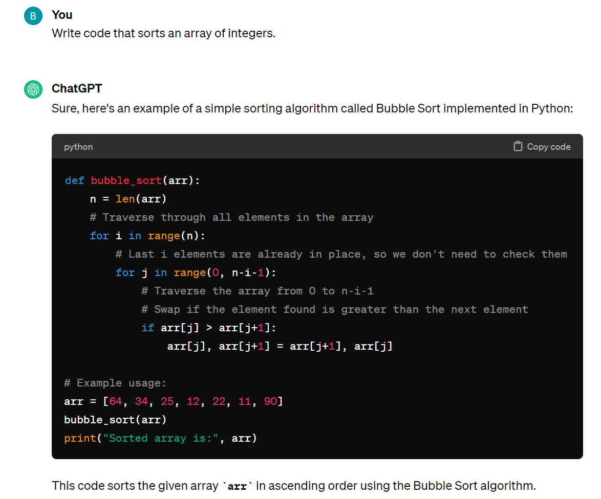
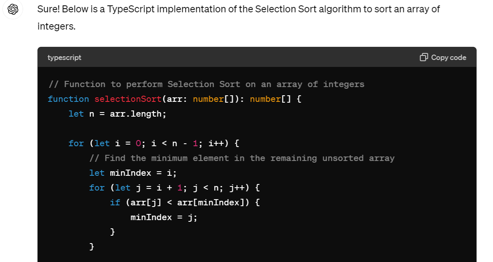
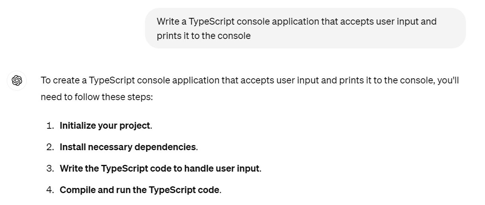

# Code Generation Prompts

* Another powerful use for prompt engineering is code generation.

* As programmers, we often leverage ideas from various resources to implement our own coding solutions. We also use various tools to generate templates that serve as starting points for the basic structure of newly created applications. These include:

  * Textbooks that provide useful and reusable techniques for solving common coding problems

  * Blogs that host high-level discussions of architectural approaches and programming techniques

  * Online forums in which solutions are posted in response to questions and issues posted by the programming community

  * Integrated Development Environments (IDEs) that provide "wizards" that assist developers by generating code

  * Web-based tools that provide useful starting point application structures

* In many ways, AI-powered code generation can be considered the "next generation" of all of the above.

* In each scenario, we have a problem to solve and we are looking for helpful ideas to get us started.

* We then evaluate and selectively integrate the information from the provided source, whether it is a colleague, book, website, IDE, or ChatGPT.

* As with any type of prompt, the specificity of a code generation response will depend on the information we provide it.

* Open ChatGPT in your browser and demonstrate the following:

  * Using the example from earlier in the lesson, we can make a general request to generate code as follows:

    

  * Because we did not specify a programming language, ChatGPT chose to respond with Python code that makes use of the selection sort algorithm.

  * We can also be more specific with our request:

    

  * This time, ChatGPT responds using the programming language (TypeScript) and sort algorithm (selection sort) of our choice.

  * We can also make requests to generate entire applications. For example, consider the following two prompts:

    

    

  * In both cases, ChatGPT generates the relevant code and provides instructions for incorporating any dependencies.

* As with any external source, we must use great caution when incorporating code generated by ChatGPT. We should never assume external code is perfect and should carefully review it before incorporating it into our application.

* With this in mind, all generated code should be evaluated carefully, with the following questions in mind:

  * Does the code exactly match our requirements or does it require modification?

  * Is the code well written, with proper error handling and security taken into consideration?

  * Does the code make use of the latest versions of any dependent libraries?

  * Does the code make use of any deprecated functionality?

* As general guidance, LLMs such as ChatGPT should be considered viable sources of example code. However, always remember that any externally incorporated code immediately becomes our own, and we are solely responsible it. Proceed with caution accordingly.

---
© 2024 edX Boot Camps LLC. Confidential and Proprietary. All Rights Reserved.
